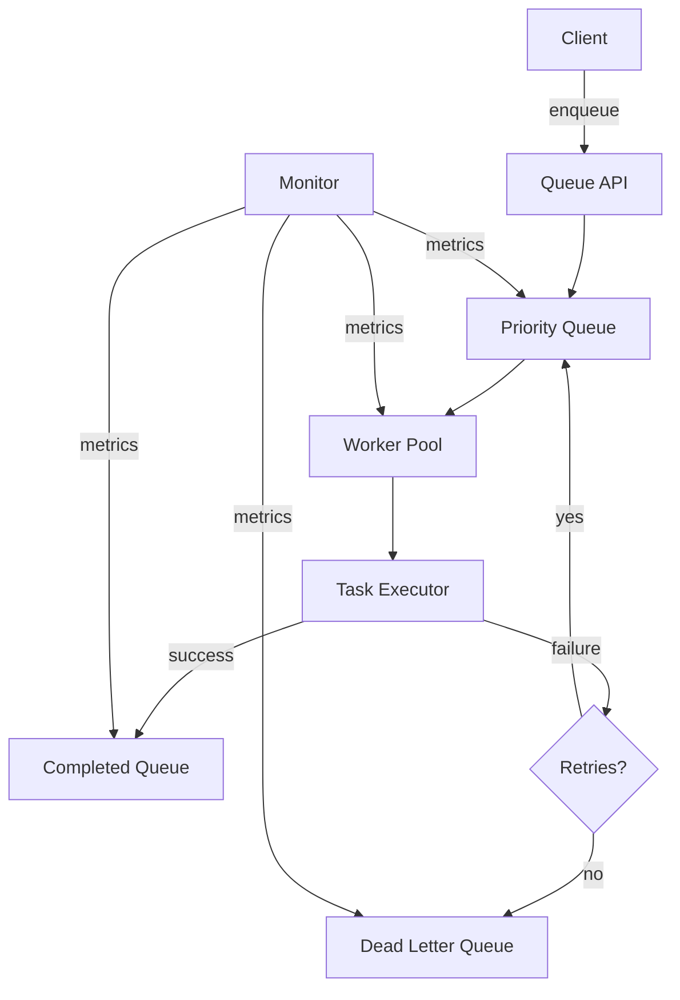

# queue.do Architecture

Understanding the internal architecture of queue.do helps you build more efficient and reliable task processing systems.

## System Overview



## Core Components

### Queue

The queue stores and manages tasks:

```typescript
interface Queue {
  $type: 'Queue'
  $id: string
  name: string
  backend: 'redis' | 'memory' | 'postgres'
  maxSize?: number
  maxRetries: number
  retryDelay: number
  retryBackoff: 'exponential' | 'linear' | 'fixed'
  deadLetterQueue?: string
  priority: boolean
  metrics: QueueMetrics
}

interface QueueMetrics {
  pending: number
  processing: number
  completed: number
  failed: number
  throughput: number // tasks/second
  avgExecutionTime: number // milliseconds
}
```

### Task

Individual work units:

```typescript
interface Task {
  $type: 'Task'
  $id: string
  queue: string
  data: any
  priority: 'critical' | 'high' | 'normal' | 'low'
  state: 'pending' | 'processing' | 'completed' | 'failed' | 'cancelled'
  attempts: number
  maxRetries: number
  createdAt: Date
  startedAt?: Date
  completedAt?: Date
  timeout: number
  error?: Error
  result?: any
}
```

### Worker

Task processor:

```typescript
interface Worker {
  $type: 'Worker'
  $id: string
  queue: string
  handler: TaskHandler
  concurrency: number
  timeout: number
  retries: number
  state: 'idle' | 'processing' | 'stopped'
  processed: number
  failed: number
}

type TaskHandler = (task: Task) => Promise<any>
```

## Queue Backends

### Redis Backend (Recommended)

Uses Redis for distributed queuing:

```typescript
// Configuration
{
  backend: 'redis',
  redisUrl: 'redis://localhost:6379',
  keyPrefix: 'queue:',
  maxRetriesPerRequest: 3
}

// Data structures
// Lists for queues
LPUSH queue:pending task-id
RPOP queue:pending

// Hashes for task data
HSET task:task-id data '{"action":"..."}'

// Sorted sets for priority
ZADD queue:priority score task-id

// Sorted sets for delayed tasks
ZADD queue:delayed timestamp task-id
```

Benefits:

- Distributed across multiple processes
- Persistence and durability
- Atomic operations
- Pub/sub for real-time updates
- Production-ready

### Memory Backend (Development)

In-memory queuing for development:

```typescript
// Configuration
{
  backend: 'memory',
  maxSize: 10000
}

// Implementation
class MemoryQueue {
  private queues: Map<string, Task[]> = new Map()
  private processing: Map<string, Task> = new Map()
}
```

Benefits:

- No external dependencies
- Fast for development
- Easy debugging

Limitations:

- Not distributed
- No persistence
- Lost on restart
- Memory limited

### PostgreSQL Backend

Database-backed queuing:

```typescript
// Configuration
{
  backend: 'postgres',
  connectionString: 'postgres://...'
}

// Schema
CREATE TABLE queue_tasks (
  id TEXT PRIMARY KEY,
  queue TEXT NOT NULL,
  data JSONB NOT NULL,
  priority INTEGER NOT NULL,
  state TEXT NOT NULL,
  attempts INTEGER DEFAULT 0,
  max_retries INTEGER NOT NULL,
  created_at TIMESTAMP DEFAULT NOW(),
  started_at TIMESTAMP,
  completed_at TIMESTAMP,
  run_at TIMESTAMP,
  timeout INTEGER,
  error TEXT,
  result JSONB
);

CREATE INDEX idx_queue_state ON queue_tasks(queue, state);
CREATE INDEX idx_priority ON queue_tasks(priority DESC, created_at ASC);
CREATE INDEX idx_run_at ON queue_tasks(run_at) WHERE state = 'pending';
```

Benefits:

- Transactional guarantees
- Complex queries
- Existing infrastructure
- Backup and replication

## Priority Queue Implementation

Tasks are processed by priority:

```typescript
class PriorityQueue {
  private queues = {
    critical: [],
    high: [],
    normal: [],
    low: [],
  }

  enqueue(task: Task) {
    this.queues[task.priority].push(task)
  }

  dequeue(): Task | null {
    // Check in priority order
    for (const priority of ['critical', 'high', 'normal', 'low']) {
      const task = this.queues[priority].shift()
      if (task) return task
    }
    return null
  }
}
```

## Worker Pool

Manages concurrent task execution:

```typescript
class WorkerPool {
  private workers: Worker[] = []
  private concurrency: number

  async start() {
    for (let i = 0; i < this.concurrency; i++) {
      this.workers.push(this.createWorker())
    }
  }

  private createWorker(): Worker {
    return {
      async process() {
        while (true) {
          const task = await queue.dequeue()
          if (!task) {
            await sleep(100)
            continue
          }

          try {
            await this.execute(task)
          } catch (error) {
            await this.handleError(task, error)
          }
        }
      },
    }
  }
}
```

## Task Execution Flow

```typescript
async function executeTask(task: Task): Promise<any> {
  // 1. Mark as processing
  task.state = 'processing'
  task.startedAt = new Date()
  await updateTask(task)

  try {
    // 2. Execute with timeout
    const result = await Promise.race([handler(task), timeout(task.timeout)])

    // 3. Mark as completed
    task.state = 'completed'
    task.completedAt = new Date()
    task.result = result
    await updateTask(task)

    return result
  } catch (error) {
    // 4. Handle failure
    task.attempts++
    task.error = error

    if (task.attempts < task.maxRetries) {
      // 5. Retry
      task.state = 'pending'
      const delay = calculateRetryDelay(task)
      await enqueueWithDelay(task, delay)
    } else {
      // 6. Move to dead letter queue
      task.state = 'failed'
      await moveToDeadLetterQueue(task)
    }

    throw error
  }
}
```

## Retry Strategy

### Exponential Backoff

```typescript
function exponentialBackoff(attempt: number, baseDelay: number): number {
  return baseDelay * Math.pow(2, attempt - 1)
}

// Example: baseDelay = 1000ms
// Attempt 1: 1000ms
// Attempt 2: 2000ms
// Attempt 3: 4000ms
// Attempt 4: 8000ms
// Attempt 5: 16000ms
```

### Linear Backoff

```typescript
function linearBackoff(attempt: number, baseDelay: number): number {
  return baseDelay * attempt
}

// Example: baseDelay = 5000ms
// Attempt 1: 5000ms
// Attempt 2: 10000ms
// Attempt 3: 15000ms
```

### Fixed Delay

```typescript
function fixedDelay(attempt: number, baseDelay: number): number {
  return baseDelay
}

// All attempts: same delay
```

## Dead Letter Queue

Failed tasks are moved to a dead letter queue:

```typescript
async function moveToDeadLetterQueue(task: Task) {
  const dlqTask = {
    ...task,
    originalQueue: task.queue,
    failedAt: new Date(),
    totalAttempts: task.attempts,
  }

  await queue.enqueue(task.deadLetterQueue || '$.Task.failed', dlqTask)
}
```

## Scheduled Tasks

Tasks can be scheduled for future execution:

```typescript
class DelayedQueue {
  private delayed: SortedSet<Task> = new SortedSet()

  async enqueue(task: Task, runAt: Date) {
    this.delayed.add(task, runAt.getTime())
  }

  async checkScheduled() {
    const now = Date.now()
    const ready = this.delayed.range(0, now)

    for (const task of ready) {
      await queue.enqueue(task)
      this.delayed.remove(task)
    }
  }
}

// Check every second
setInterval(() => delayedQueue.checkScheduled(), 1000)
```

## Monitoring and Metrics

Track queue performance:

```typescript
interface QueueMetrics {
  // Counts
  pending: number
  processing: number
  completed: number
  failed: number

  // Performance
  throughput: number // tasks/second
  avgExecutionTime: number // milliseconds
  p50ExecutionTime: number
  p95ExecutionTime: number
  p99ExecutionTime: number

  // Errors
  errorRate: number // percentage
  retryRate: number // percentage
}

// Collect metrics
async function collectMetrics(): Promise<QueueMetrics> {
  const tasks = await queue.list()

  return {
    pending: tasks.filter((t) => t.state === 'pending').length,
    processing: tasks.filter((t) => t.state === 'processing').length,
    completed: tasks.filter((t) => t.state === 'completed').length,
    failed: tasks.filter((t) => t.state === 'failed').length,
    throughput: calculateThroughput(tasks),
    avgExecutionTime: calculateAvgTime(tasks),
    // ...
  }
}
```

## Concurrency Control

Manage worker concurrency:

```typescript
class ConcurrencyLimiter {
  private running: number = 0
  private maxConcurrency: number

  async acquire() {
    while (this.running >= this.maxConcurrency) {
      await sleep(10)
    }
    this.running++
  }

  release() {
    this.running--
  }
}

// Usage
await limiter.acquire()
try {
  await processTask(task)
} finally {
  limiter.release()
}
```

## Rate Limiting

Limit task processing rate:

```typescript
class RateLimiter {
  private tokens: number
  private maxTokens: number
  private refillRate: number // tokens per second

  async acquire() {
    while (this.tokens < 1) {
      await sleep(100)
    }
    this.tokens--
  }

  private refill() {
    setInterval(() => {
      this.tokens = Math.min(this.tokens + this.refillRate, this.maxTokens)
    }, 1000)
  }
}
```

## Fault Tolerance

Handle system failures gracefully:

### Worker Failures

```typescript
// Heartbeat mechanism
setInterval(async () => {
  const staleTime = Date.now() - 60000 // 1 minute

  const staleTasks = await queue.list({
    state: 'processing',
    startedAt: { $lt: staleTime },
  })

  for (const task of staleTasks) {
    // Requeue stale tasks
    task.state = 'pending'
    await updateTask(task)
  }
}, 10000) // Check every 10 seconds
```

### Queue Overflow

```typescript
async function enqueue(task: Task) {
  const queueSize = await queue.size()

  if (queueSize >= maxSize) {
    if (task.priority === 'critical') {
      // Always accept critical tasks
      await queue.push(task)
    } else {
      throw new Error('Queue full')
    }
  } else {
    await queue.push(task)
  }
}
```

## Performance Optimization

### Batch Processing

```typescript
async function processBatch(tasks: Task[]) {
  const results = await Promise.all(tasks.map((task) => processTask(task)))
  return results
}
```

### Connection Pooling

```typescript
// Redis connection pool
const pool = new RedisPool({
  min: 2,
  max: 10,
})
```

### Task Prefetching

```typescript
class Worker {
  private prefetchCount = 10
  private buffer: Task[] = []

  async prefetch() {
    if (this.buffer.length < this.prefetchCount) {
      const tasks = await queue.dequeue(this.prefetchCount)
      this.buffer.push(...tasks)
    }
  }

  async process() {
    await this.prefetch()
    const task = this.buffer.shift()
    await processTask(task)
  }
}
```

## Related

- [Best Practices](./best-practices)
- [Troubleshooting](./troubleshooting)
- [API Reference](../api/)
