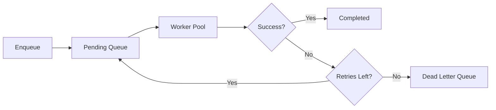

# queue.do

**Task Queue Management for Business-as-Code**

queue.do is the distributed task queue system for the `.do` platform, enabling you to build resilient, scalable background job processing with semantic patterns. Handle high-volume tasks, prioritize critical jobs, implement retry logic, and manage dead letter queues using `$.Subject.predicate.Object` patterns.

## What is a Task Queue?

A task queue is a distributed system that:

- **Enqueues**: Accept tasks for asynchronous processing
- **Processes**: Execute tasks in background workers
- **Retries**: Automatically retry failed tasks
- **Prioritizes**: Handle critical tasks first
- **Scales**: Distribute work across multiple workers
- **Monitors**: Track task status and performance

Unlike synchronous processing, task queues decouple task submission from execution, enabling better scalability, fault tolerance, and resource utilization.

## Quick Start

```bash
pnpm add sdk.do
```

```typescript
import $, { queue } from 'sdk.do'

// Enqueue a simple task
await queue.enqueue($.EmailSendTask, {
  to: 'user@example.com',
  subject: 'Welcome!',
  body: 'Welcome to our platform',
})

// Process tasks with a worker
await queue.worker($.EmailSendTask, async (task) => {
  await sendEmail(task.data)
  return { status: 'sent' }
})

// Enqueue with priority
await queue.enqueue(
  $.PaymentProcessTask,
  {
    orderId: 'order-123',
    amount: 99.99,
  },
  {
    priority: 'high',
    retries: 3,
  }
)
```

## Key Features

### Simple Task Enqueue

Enqueue tasks for background processing:

```typescript
import { queue } from 'sdk.do'

// Basic task
await queue.enqueue($.Task, {
  action: 'process_order',
  orderId: 'order-123',
})

// With options
await queue.enqueue(
  $.Task,
  {
    action: 'send_report',
    userId: 'user-456',
  },
  {
    delay: 60000, // Delay 1 minute
    priority: 'normal',
    retries: 3,
    timeout: 30000,
  }
)

// Batch enqueue
await queue.enqueueBatch([
  { type: $.Task, data: { action: 'task1' } },
  { type: $.Task, data: { action: 'task2' } },
  { type: $.Task, data: { action: 'task3' } },
])
```

### Worker Processing

Process tasks with typed workers:

```typescript
import { queue } from 'sdk.do'

// Simple worker
await queue.worker($.EmailSendTask, async (task) => {
  const { to, subject, body } = task.data
  await sendEmail({ to, subject, body })
  return { sent: true }
})

// Worker with error handling
await queue.worker(
  $.PaymentProcessTask,
  async (task) => {
    try {
      const result = await processPayment(task.data)
      return { success: true, transactionId: result.id }
    } catch (error) {
      // Task will be retried if retries configured
      throw new Error(`Payment failed: ${error.message}`)
    }
  },
  {
    concurrency: 5, // Process 5 tasks concurrently
    timeout: 30000, // 30 second timeout
    retries: 3,
  }
)

// Multiple workers for different task types
await Promise.all([queue.worker($.EmailTask, emailHandler), queue.worker($.PaymentTask, paymentHandler), queue.worker($.ReportTask, reportHandler)])
```

### Priority Queues

Handle critical tasks first:

```typescript
import { queue } from 'sdk.do'

// Enqueue with priority
await queue.enqueue(
  $.Task,
  { action: 'urgent' },
  {
    priority: 'critical', // critical > high > normal > low
  }
)

await queue.enqueue(
  $.Task,
  { action: 'normal' },
  {
    priority: 'normal',
  }
)

await queue.enqueue(
  $.Task,
  { action: 'background' },
  {
    priority: 'low',
  }
)

// Worker processes by priority
await queue.worker($.Task, async (task) => {
  console.log(`Processing ${task.priority} priority task`)
  // Critical tasks processed first
})
```

### Retry Logic

Automatically retry failed tasks:

```typescript
import { queue } from 'sdk.do'

// Configure retry behavior
await queue.enqueue(
  $.Task,
  { action: 'flaky_operation' },
  {
    retries: 5,
    retryDelay: 1000, // 1 second
    retryBackoff: 'exponential', // exponential | linear | fixed
  }
)

// Worker with custom retry logic
await queue.worker(
  $.Task,
  async (task) => {
    // Throw error to trigger retry
    if (shouldRetry) {
      throw new Error('Temporary failure, retry')
    }

    // Return success
    return { completed: true }
  },
  {
    retries: 3,
    onRetry: (task, attempt, error) => {
      console.log(`Retry ${attempt} for task ${task.id}: ${error.message}`)
    },
  }
)
```

### Dead Letter Queues

Handle permanently failed tasks:

```typescript
import { queue } from 'sdk.do'

// Configure dead letter queue
await queue.enqueue(
  $.Task,
  { action: 'critical' },
  {
    retries: 3,
    deadLetterQueue: '$.Task.failed',
  }
)

// Process dead letter queue
await queue.worker('$.Task.failed', async (task) => {
  console.error('Task permanently failed:', task)

  // Log to monitoring system
  await logError({
    taskId: task.id,
    attempts: task.attempts,
    error: task.error,
  })

  // Notify team
  await notify({
    channel: 'ops',
    message: `Task ${task.id} failed after ${task.attempts} attempts`,
  })
})
```

### Scheduled Tasks

Enqueue tasks for future execution:

```typescript
import { queue } from 'sdk.do'

// Delay execution
await queue.enqueue(
  $.Task,
  { action: 'reminder' },
  {
    delay: 3600000, // Execute in 1 hour
  }
)

// Schedule for specific time
await queue.enqueue(
  $.Task,
  { action: 'report' },
  {
    runAt: new Date('2025-10-11T09:00:00Z'),
  }
)

// Recurring tasks (use with every)
import { every } from 'sdk.do'

every($.Daily, async () => {
  await queue.enqueue($.DailyReportTask, {
    date: new Date().toISOString(),
  })
})
```

### Task Status Tracking

Monitor task progress:

```typescript
import { queue } from 'sdk.do'

// Enqueue and get task ID
const taskId = await queue.enqueue($.Task, { action: 'long_process' })

// Check task status
const status = await queue.status(taskId)
// { id, state: 'pending' | 'processing' | 'completed' | 'failed' }

// Wait for completion
const result = await queue.wait(taskId)
// Returns when task completes or fails

// List tasks
const pending = await queue.list({ state: 'pending' })
const failed = await queue.list({ state: 'failed' })
const completed = await queue.list({ state: 'completed', limit: 100 })
```

### Task Cancellation

Cancel queued or running tasks:

```typescript
import { queue } from 'sdk.do'

// Enqueue task
const taskId = await queue.enqueue($.Task, { action: 'process' })

// Cancel before processing
await queue.cancel(taskId)

// Cancel all pending tasks of a type
await queue.cancelAll($.Task, { state: 'pending' })

// Cancel with cleanup
await queue.cancel(taskId, {
  cleanup: async (task) => {
    await cleanupResources(task.data)
  },
})
```

## Semantic Patterns

queue.do uses semantic `$.Subject.predicate.Object` patterns:

```typescript
import $ from 'sdk.do'

// Task types
$.Task
$.Job
$.EmailSendTask
$.PaymentProcessTask
$.ReportGenerationTask
$.DataSyncTask

// Task operations
$.Task.enqueued
$.Task.processing
$.Task.completed
$.Task.failed
$.Task.retried
$.Task.cancelled

// Queue relationships
$.Queue.contains.Task
$.Worker.processes.Task
$.Task.belongsTo.Queue
$.Task.retriedBy.Worker
$.Task.movedTo.DeadLetterQueue

// Queue patterns
$.Queue.priority.high
$.Queue.priority.normal
$.Queue.priority.low
$.Queue.retry.exponential
$.Queue.retry.linear
```

## Architecture

### Queue Components

```typescript
interface Queue {
  $type: 'Queue'
  $id: string
  name: string
  maxSize?: number
  maxRetries: number
  retryDelay: number
  retryBackoff: 'exponential' | 'linear' | 'fixed'
  deadLetterQueue?: string
  priority: boolean
}

interface Task {
  $type: 'Task'
  $id: string
  queue: string
  data: any
  priority: 'critical' | 'high' | 'normal' | 'low'
  state: 'pending' | 'processing' | 'completed' | 'failed'
  attempts: number
  maxRetries: number
  createdAt: Date
  startedAt?: Date
  completedAt?: Date
  error?: Error
}

interface Worker {
  $type: 'Worker'
  $id: string
  queue: string
  handler: (task: Task) => Promise<any>
  concurrency: number
  timeout: number
  retries: number
}
```

### Task Lifecycle

```typescript
// 1. Task enqueued
const taskId = await queue.enqueue($.Task, data)
// State: pending

// 2. Worker picks up task
// State: processing

// 3a. Task succeeds
// State: completed

// 3b. Task fails, retry
// State: pending, attempts++

// 3c. Task exceeds retries
// State: failed, moved to dead letter queue
```

### Processing Flow



## Integration with .do Platform

queue.do integrates with all `.do` platform services:

```typescript
import $, { queue, db, on, send, every } from 'sdk.do'

// Enqueue tasks on events
on($.Order.created, async (order) => {
  await queue.enqueue(
    $.OrderProcessTask,
    {
      orderId: order.$id,
      customer: order.customer,
    },
    {
      priority: 'high',
    }
  )
})

// Process tasks with database access
await queue.worker($.OrderProcessTask, async (task) => {
  const order = await db.get($.Order, task.data.orderId)

  // Process order
  await processOrder(order)

  // Update database
  await db.update(order, { status: 'processed' })

  // Send event
  send($.Order.processed, order)

  return { success: true }
})

// Schedule recurring queue cleanup
every($.Hourly, async () => {
  await queue.cleanup({
    state: 'completed',
    olderThan: Date.now() - 24 * 60 * 60 * 1000, // 24 hours
  })
})
```

## Use Cases

### Email Queue

Process high-volume email sending:

```typescript
import { queue } from 'sdk.do'

// Enqueue emails
await queue.enqueueBatch(
  users.map((user) => ({
    type: $.EmailSendTask,
    data: {
      to: user.email,
      subject: 'Monthly Newsletter',
      template: 'newsletter',
      data: { name: user.name },
    },
  }))
)

// Process with rate limiting
await queue.worker(
  $.EmailSendTask,
  async (task) => {
    await sendEmail(task.data)
    await sleep(100) // Rate limit: 10 emails/second
  },
  {
    concurrency: 10,
  }
)
```

### Payment Processing

Handle payment tasks with retry logic:

```typescript
import { queue } from 'sdk.do'

// Enqueue payment
await queue.enqueue(
  $.PaymentProcessTask,
  {
    orderId: 'order-123',
    amount: 99.99,
    paymentMethod: 'card_xxx',
  },
  {
    priority: 'critical',
    retries: 3,
    retryBackoff: 'exponential',
    timeout: 30000,
  }
)

// Process payments
await queue.worker(
  $.PaymentProcessTask,
  async (task) => {
    const { orderId, amount, paymentMethod } = task.data

    // Charge payment
    const result = await chargePayment({
      amount,
      paymentMethod,
    })

    // Update order
    await db.update($.Order, orderId, {
      paymentStatus: 'paid',
      transactionId: result.id,
    })

    return result
  },
  {
    retries: 3,
    onRetry: async (task, attempt) => {
      console.log(`Payment retry ${attempt} for order ${task.data.orderId}`)
    },
  }
)
```

### Image Processing

Process uploaded images in background:

```typescript
import { queue } from 'sdk.do'

// Enqueue image processing on upload
on($.Image.uploaded, async (image) => {
  await queue.enqueue($.ImageProcessTask, {
    imageId: image.$id,
    url: image.url,
    operations: ['resize', 'optimize', 'thumbnail'],
  })
})

// Process images
await queue.worker(
  $.ImageProcessTask,
  async (task) => {
    const { imageId, url, operations } = task.data

    let processedUrl = url

    for (const op of operations) {
      switch (op) {
        case 'resize':
          processedUrl = await resizeImage(processedUrl, { width: 1200 })
          break
        case 'optimize':
          processedUrl = await optimizeImage(processedUrl)
          break
        case 'thumbnail':
          await generateThumbnail(processedUrl)
          break
      }
    }

    // Update image record
    await db.update($.Image, imageId, {
      processedUrl,
      status: 'processed',
    })

    return { processedUrl }
  },
  {
    concurrency: 3, // Process 3 images concurrently
    timeout: 60000, // 60 second timeout
  }
)
```

### Report Generation

Generate large reports asynchronously:

```typescript
import { queue } from 'sdk.do'

// Enqueue report generation
await queue.enqueue(
  $.ReportGenerationTask,
  {
    reportType: 'sales_analytics',
    startDate: '2025-01-01',
    endDate: '2025-12-31',
    userId: 'user-123',
  },
  {
    delay: 0, // Start immediately
    timeout: 300000, // 5 minute timeout
  }
)

// Process reports
await queue.worker(
  $.ReportGenerationTask,
  async (task) => {
    const { reportType, startDate, endDate, userId } = task.data

    // Generate report
    const report = await generateReport({
      type: reportType,
      dateRange: { start: startDate, end: endDate },
    })

    // Save to storage
    const reportUrl = await saveReport(report)

    // Notify user
    send($.Report.ready, {
      userId,
      reportUrl,
      type: reportType,
    })

    return { reportUrl }
  },
  {
    concurrency: 2, // Limit concurrent report generation
    timeout: 300000,
  }
)
```

### Data Synchronization

Sync data between systems:

```typescript
import { queue, every } from 'sdk.do'

// Schedule periodic sync
every('0 */6 * * *', async () => {
  // Every 6 hours
  await queue.enqueue($.DataSyncTask, {
    source: 'crm',
    destination: 'warehouse',
    entities: ['customers', 'orders', 'products'],
  })
})

// Process sync tasks
await queue.worker(
  $.DataSyncTask,
  async (task) => {
    const { source, destination, entities } = task.data

    const results = []

    for (const entity of entities) {
      // Fetch from source
      const data = await fetchData(source, entity)

      // Transform
      const transformed = await transformData(data)

      // Load to destination
      await loadData(destination, entity, transformed)

      results.push({
        entity,
        recordCount: data.length,
      })
    }

    return { synced: results }
  },
  {
    retries: 5,
    retryBackoff: 'exponential',
  }
)
```

## Documentation

- [Getting Started](./docs/getting-started) - Setup and first queue
- [Architecture](./docs/architecture) - Queue system design
- [Best Practices](./docs/best-practices) - Production patterns
- [Troubleshooting](./docs/troubleshooting) - Common issues
- [API Reference](./api/) - Complete API documentation
- [Examples](./examples/) - Real-world queue examples

## Best Practices

### 1. Use Appropriate Priority

Reserve high priority for truly critical tasks:

```typescript
// Critical - payment processing, security alerts
await queue.enqueue($.Task, data, { priority: 'critical' })

// High - user-facing operations, time-sensitive
await queue.enqueue($.Task, data, { priority: 'high' })

// Normal - regular background tasks
await queue.enqueue($.Task, data, { priority: 'normal' })

// Low - cleanup, maintenance, analytics
await queue.enqueue($.Task, data, { priority: 'low' })
```

### 2. Configure Retry Logic

Set appropriate retry policies:

```typescript
// Transient failures - aggressive retries
await queue.enqueue($.Task, data, {
  retries: 5,
  retryDelay: 1000,
  retryBackoff: 'exponential',
})

// External API calls - moderate retries
await queue.enqueue($.Task, data, {
  retries: 3,
  retryDelay: 5000,
  retryBackoff: 'linear',
})

// Non-retriable operations - no retries
await queue.enqueue($.Task, data, {
  retries: 0,
})
```

### 3. Set Timeouts

Prevent tasks from hanging:

```typescript
await queue.worker($.Task, handler, {
  timeout: 30000, // 30 seconds
  onTimeout: (task) => {
    console.error(`Task ${task.id} timed out`)
  },
})
```

### 4. Monitor Dead Letter Queue

Always process failed tasks:

```typescript
await queue.worker('$.Task.failed', async (task) => {
  // Log for investigation
  await logError(task)

  // Alert ops team
  await alertOps({
    subject: 'Task Failed',
    taskId: task.id,
    error: task.error,
  })

  // Store for manual review
  await db.create($.FailedTask, task)
})
```

### 5. Use Batch Operations

Enqueue multiple tasks efficiently:

```typescript
// Good - batch enqueue
await queue.enqueueBatch(
  items.map((item) => ({
    type: $.Task,
    data: item,
  }))
)

// Avoid - individual enqueue
for (const item of items) {
  await queue.enqueue($.Task, item)
}
```

### 6. Implement Idempotency

Ensure tasks can be safely retried:

```typescript
await queue.worker($.Task, async (task) => {
  const { orderId } = task.data

  // Check if already processed
  const existing = await db.get($.ProcessedOrder, orderId)
  if (existing) {
    return { skipped: true, reason: 'already processed' }
  }

  // Process order
  const result = await processOrder(orderId)

  // Mark as processed
  await db.create($.ProcessedOrder, { orderId, processedAt: new Date() })

  return result
})
```

### 7. Scale Workers

Adjust concurrency based on load:

```typescript
// CPU-intensive tasks - limit concurrency
await queue.worker($.ImageProcessTask, handler, {
  concurrency: os.cpus().length,
})

// I/O-bound tasks - higher concurrency
await queue.worker($.EmailSendTask, handler, {
  concurrency: 50,
})

// Memory-intensive tasks - very limited
await queue.worker($.ReportTask, handler, {
  concurrency: 2,
})
```

## Related Projects

- [schedule.do](https://schedule.do) - Cron jobs and scheduled tasks
- [workflows.do](https://workflows.do) - Workflow orchestration
- [events.do](https://events.do) - Event system
- [sdk.do](https://sdk.do) - Core SDK
- [functions.do](https://functions.do) - Function execution

## License

MIT (Open Source)

queue.do is open-source software released under the MIT License.

## Resources

- [GitHub Repository](https://github.com/dot-do/ai)
- [Issue Tracker](https://github.com/dot-do/ai/issues)
- [Contributing Guide](https://github.com/dot-do/ai/blob/main/CONTRIBUTING.md)

---

Part of the [`.do` platform](https://github.com/dot-do/platform) open-source ecosystem.
